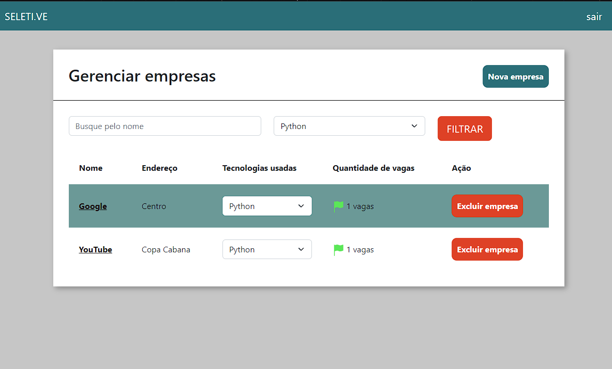
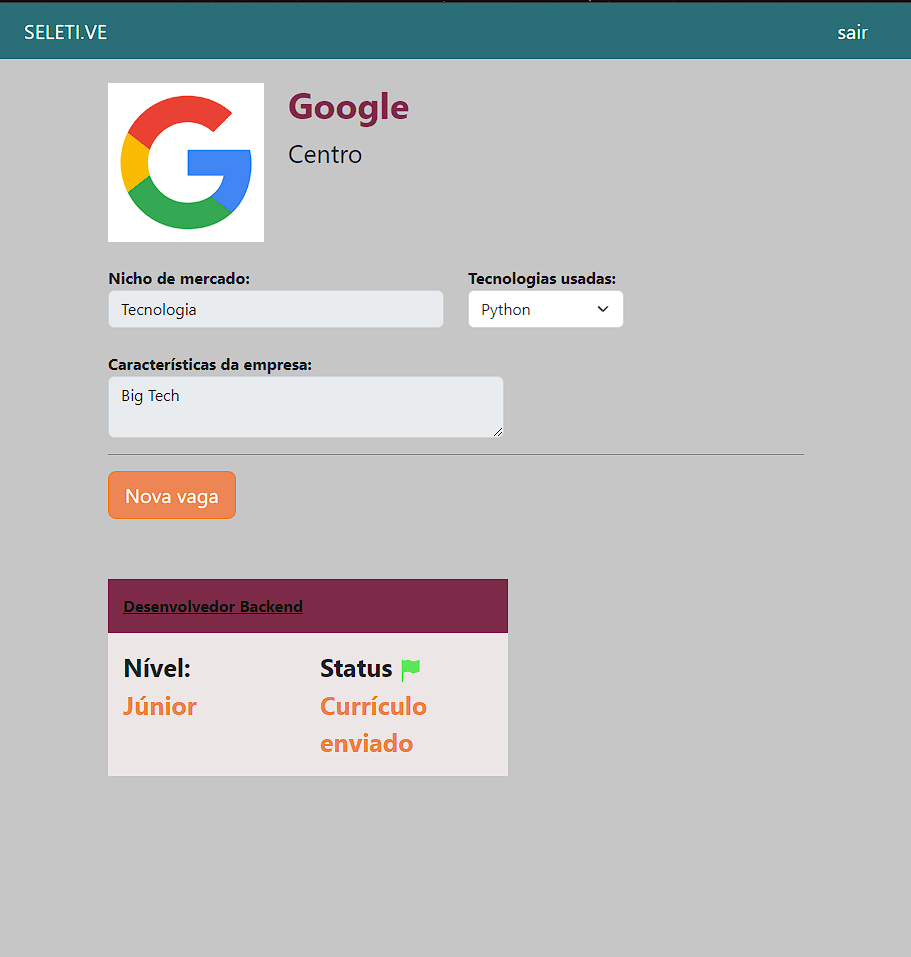
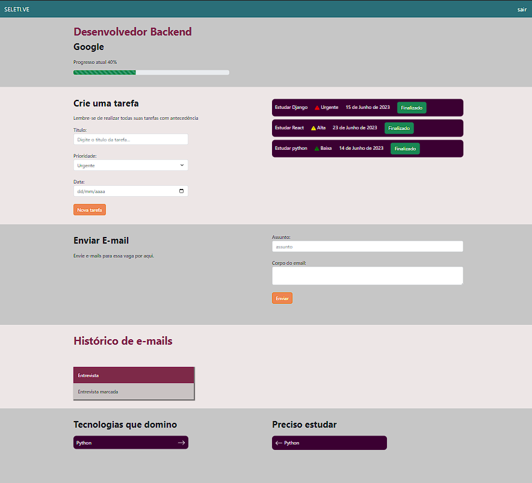

<h1 align="center"> Seletive </h1>

Gerenciador de processos seletivos desenvolvido com Django, que permite aos usuários 
organizarem e acompanharem as vagas de emprego para as quais se candidataram. Com 
uma interface amigável e recursos de filtragem, o projeto facilita o gerenciamento eficiente 
das candidaturas e fornece uma visão clara do status de cada processo seletivo. 

  <a href="#-tecnologias">Tecnologias</a>&nbsp;&nbsp;&nbsp;|&nbsp;&nbsp;&nbsp;
  <a href="#-projeto">Projeto</a>&nbsp;&nbsp;&nbsp;|&nbsp;&nbsp;&nbsp;
  <a href="#-layout">Layout</a>&nbsp;&nbsp;&nbsp;|&nbsp;&nbsp;&nbsp;
  <a href="#memo-licença">Licença</a>

  

 

## Home

  

## Página da empresa cadastrada

  

## Descrição da vaga

  

## 🚀 Tecnologias

Esse projeto foi desenvolvido com as seguintes tecnologias:

- HTML, CSS
- Python, Django
- Git, figma

## 💻 Projeto

 Seletive é um gerenciador de processos seletivos voltado para programadores. O objetivo desse projeto foi criar uma plataforma que permitisse aos programadores gerenciar as vagas de emprego para as quais se aplicaram, de forma organizada e eficiente.

O Seletive foi construído utilizando Django como framework principal. Utilizei as funcionalidades do Django para criar uma interface intuitiva e amigável, facilitando a navegação e o uso da plataforma. Além disso, o sistema de autenticação do Django foi implementado para garantir a segurança e a privacidade dos usuários.

A plataforma permite aos usuários cadastrarem as vagas de emprego às quais se candidataram, registrando informações relevantes, como o nome da empresa, a descrição da vaga e o status do processo seletivo. Os usuários também podem adicionar notas pessoais, datas importantes e tarefas relacionados a cada vaga.

Além disso, o Seletive oferece recursos de filtragem e pesquisa para que os programadores possam encontrar facilmente as vagas que desejam acompanhar. Isso ajuda a organizar e gerenciar de forma eficiente as candidaturas em diferentes empresas e processos seletivos.

## 🔖 Layout

Você pode visualizar o layout do projeto através [DESSE LINK](https://www.figma.com/file/rPWCJABt3WnDdSaRQvzMCM/PYLAB-2022?type=design&node-id=0-1&mode=design&t=we8eJ0n5LMehRRtY-0). É necessário ter conta no [Figma](https://figma.com) para acessá-lo.

## :memo: Licença

Esse projeto está sob a licença MIT.